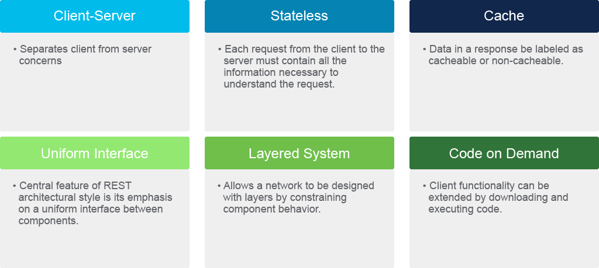
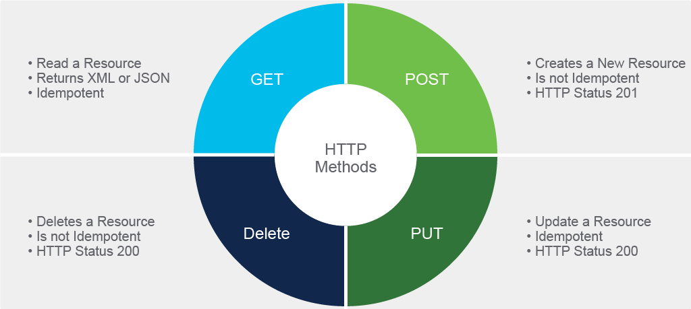
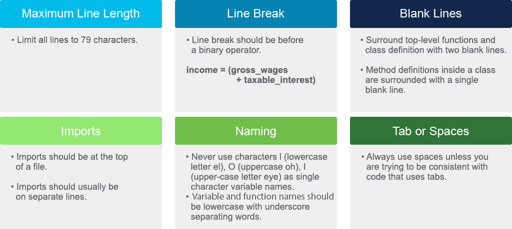

# Section 1 - Intro to Python

## Programmability

Manual human-centric processes are slow and do not scale to large networks.

SNMP was introduced in 1988 to address the growing needs. Although SNMP can be used to configure and monitor, but due to shortcomings SNMP is rarely used for configuring devices.

## Automation vs Orchestration

* **Automation**: Accomplishing repeatable tasks without human intervention
* **Orchestration**: Combining a series of tasks to accomplish a process or workflow

## Benefits

* **Time and cost savings**: reduces complexities; less hours needed for configuring, provisioning, and managing
* **Fewer errors**: removing (or reducing) human errors
* **Agile network**: improve time-to-market
* **Greater insight and network control**: more responsivive and more visibility
* **Increase in strategic workforce**: increase productivity

### API History

Vendors initially introduced proprietary APIs (NX-API) and later open APIs (NETCONF, RESTCONF) were added.

### API Definition

* API
    * software intermediary allowing two applications to talk
        * separates functionality into building blocks
        * provides faster prototyping
        * specifies how information is exchanged
        * provides documentation

### Historical API Types
* RPC
    * Remote Procedure Call
* XML-RPC
* JSON-RPC
* SOAP
    * Simple Object Access Protocol
* REST
    * Representational State Transfer
    * most popular currently

### REST

* not a protocol but more of an architectural style
* simple
    * uses HTTP
    * no additional libraries or software
* flexible
    * multiple data formats (XML, JSON, YAML)

#### REST Constraints

1. **Client/server**: client and the server are separate; app or resource
changes should be transparent
1. **Stateless**: independent of another; contain all the data necessary
1. **Cache**: caching possible at client to improve performance
1. **Uniform Interface**: common language and format
1. **Layered System**: always process regardless of the number of layers (device) between
1. **Code on Demand**: (optional) transmit code over API

#### HTTP Request/Response

#### HTTP Methods

* **GET**: retrieve resource; no change, thus idempotent
* **POST**: creates new resource; not idempotent; successful = HTTP 201 status
* **DELETE**: remove resource;  not idempotent; successful = HTTP 200 status
* **PUT**: replace resource; not partial update; idempotent; successful = HTTP 200 status

## Continued Importance of the CLI

* alternative way to interact with network devices
* advanced troubleshooting
* work with older devices
* work with a tool that has not been updated to use a device's API

## Python

### Python Description

* interpreted language
* platform flexibility (cross platform)
* object-oriented language
* powerful and flexible
    * developed under an OSI-approved open source license
    * freely usable and distributed making it popular

### Ecosystem

* large ecosystem
* [Python Package Index (PyPI)](https://pypi.org/)
* [Cisco DevNet Code Exchange](https://developer.cisco.com/codeexchange/)
* [GitHub](https://github.com)

Python Enhancement Proposals (PEP)
* [PEP 8](https://peps.python.org/pep-0008/) - Style Guide
* [PEP 20](https://peps.python.org/pep-0020/) - The Zen of Python

## Python Scripting

### Run Python Code

Four ways to run Python code:
* interactive shell
* terminal
* IDE or editor
* file manager of your system

### Python Interactive Shell

REPL
* Read
* Evaluate
* Print
* Loop

Python shell history at:
* (Windows) `%USERPROFILE/.python_history`
* (GNU/Linux) `~/.python_history`

### PEPs

Three Categories of PEPs
* standards track
* informational PEP
* process PEP

#### PEP 8

High level points
* Maximum Line Length
    * maximum 79 characters on a line
* Line Break
    * line break before binary operator
* Blank Lines
    * surround top-level functions and class definition with two blank lines
    * method definitions inside a class are surrounded with a single blank line
* Imports
    * imports should be at the top of the file
    * imports should usually be on separate lines
* Naming
    * as single character variables, never use lowercase L (el),
    uppercase o (oh), and uppercase i (eye)
    * variable and function names should be lowercase with underscore separating
    words
* Tabs or Spaces
    * always use spaces unless you are trying to be consistent with code that
    uses tabs
    * don't try to mix spaces and tabs

#### Checking Conformity
* [pycodestyle](https://pypi.org/project/pycodestyle/)

### Getting Help
* `dir()`
* `help()`
